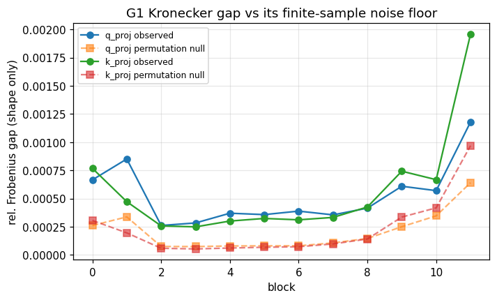
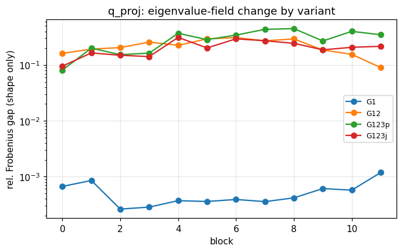
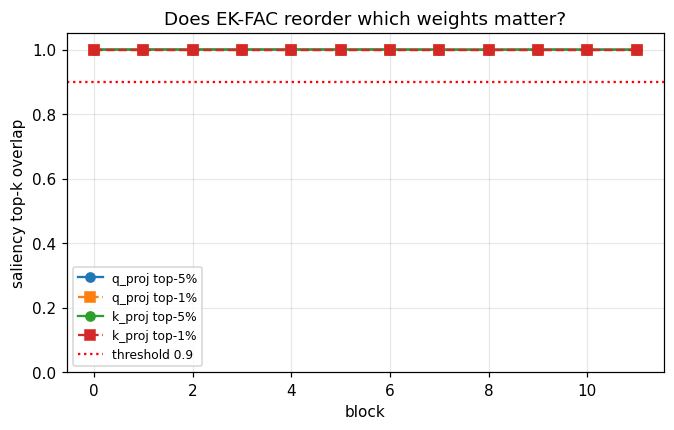

# Phase 1 - Kronecker gap diagnostic

## G1 (the faithful correction)

```
blk   layer |  G1 relF    null    xs  |log2R|  massoff |   BoA/T    G1/T  G1/T(ho) |  spear  top1%  top5%
---------------------------------------------------------------------------------------------------------
  0  q_proj |  0.00067 0.00026  2.75  0.00009  0.00000 |  1.0002  0.9999    0.9992 | 1.0000 1.0000 0.9996
  0  k_proj |  0.00077 0.00031  2.51  0.00006  0.00000 |  0.9999  1.0000    0.9992 | 1.0000 1.0000 1.0000
  1  q_proj |  0.00085 0.00034  2.84  0.00010  0.00000 |  0.9989  0.9987    0.9998 | 1.0000 1.0000 1.0000
  1  k_proj |  0.00047 0.00020  2.63  0.00006  0.00000 |  0.9996  0.9996    1.0019 | 1.0000 1.0000 1.0000
  2  q_proj |  0.00026 0.00008  3.95  0.00006  0.00000 |  0.9978  0.9978    0.9999 | 1.0000 1.0000 1.0000
  2  k_proj |  0.00026 0.00006  4.54  0.00004  0.00000 |  0.9987  0.9988    0.9996 | 1.0000 1.0000 1.0000
  3  q_proj |  0.00028 0.00007  3.66  0.00020  0.00000 |  0.9984  0.9986    1.0024 | 1.0000 1.0000 1.0000
  3  k_proj |  0.00025 0.00005  4.41  0.00008  0.00000 |  0.9980  0.9981    0.9986 | 1.0000 1.0000 1.0000
  4  q_proj |  0.00037 0.00008  4.69  0.00009  0.00000 |  0.9982  0.9984    1.0027 | 1.0000 1.0000 1.0000
  4  k_proj |  0.00030 0.00006  4.79  0.00002  0.00000 |  0.9990  0.9992    1.0009 | 1.0000 1.0000 1.0000
  5  q_proj |  0.00036 0.00008  3.87  0.00014  0.00000 |  0.9977  0.9979    1.0019 | 1.0000 1.0000 1.0000
  5  k_proj |  0.00032 0.00007  4.85  0.00005  0.00000 |  0.9984  0.9988    1.0010 | 1.0000 1.0000 1.0000
  6  q_proj |  0.00039 0.00008  4.60  0.00003  0.00000 |  0.9968  0.9973    1.0003 | 1.0000 1.0000 1.0000
  6  k_proj |  0.00031 0.00007  4.20  0.00005  0.00000 |  0.9971  0.9977    1.0020 | 1.0000 1.0000 1.0000
  7  q_proj |  0.00036 0.00011  3.36  0.00005  0.00000 |  0.9974  0.9983    0.9989 | 1.0000 1.0000 0.9996
  7  k_proj |  0.00033 0.00010  3.31  0.00006  0.00000 |  0.9976  0.9982    0.9978 | 1.0000 1.0000 0.9998
  8  q_proj |  0.00042 0.00015  3.09  0.00006  0.00000 |  0.9982  0.9987    0.9998 | 1.0000 1.0000 0.9996
  8  k_proj |  0.00043 0.00014  2.98  0.00004  0.00000 |  0.9975  0.9980    0.9994 | 1.0000 1.0000 0.9996
  9  q_proj |  0.00061 0.00025  2.44  0.00005  0.00000 |  0.9959  0.9962    1.0026 | 1.0000 1.0000 0.9998
  9  k_proj |  0.00074 0.00034  2.29  0.00005  0.00000 |  0.9971  0.9974    1.0020 | 1.0000 1.0000 1.0000
 10  q_proj |  0.00057 0.00035  1.74  0.00012  0.00000 |  0.9962  0.9966    1.0040 | 1.0000 1.0000 0.9998
 10  k_proj |  0.00067 0.00042  1.69  0.00009  0.00000 |  0.9973  0.9976    1.0049 | 1.0000 1.0000 0.9996
 11  q_proj |  0.00118 0.00064  1.92  0.00032  0.00000 |  0.9950  0.9953    1.0055 | 1.0000 1.0000 0.9996
 11  k_proj |  0.00196 0.00097  2.10  0.00015  0.00000 |  0.9960  0.9967    1.0044 | 1.0000 1.0000 0.9996
```

## Objective-change variants (G2 mask, G3 softmax weighting)

```
blk   layer |     G1 relF    G12 relF  G123p relF  G123j relF |      G1/T     G12/T   G123p/T   G123j/T
-------------------------------------------------------------------------------------------------------
  0  q_proj |     0.00067     0.16159     0.08104     0.09532 |    0.9999    0.9780    0.9192    0.9520
  0  k_proj |     0.00077     0.14916     0.10766     0.12183 |    1.0000    0.9675    0.9947    0.9922
  1  q_proj |     0.00085     0.19243     0.20003     0.16462 |    0.9987    1.0031    0.8304    0.8778
  1  k_proj |     0.00047     0.29091     0.22106     0.22408 |    0.9996    0.9475    0.9656    0.9861
  2  q_proj |     0.00026     0.20484     0.15301     0.14903 |    0.9978    0.9913    0.9145    0.9301
  2  k_proj |     0.00026     0.16528     0.19062     0.17931 |    0.9988    0.9843    0.8904    0.8892
  3  q_proj |     0.00028     0.25687     0.16298     0.14145 |    0.9986    1.0129    0.9428    0.9797
  3  k_proj |     0.00025     0.26274     0.29885     0.30010 |    0.9981    0.9783    0.9667    0.9693
  4  q_proj |     0.00037     0.22481     0.36976     0.31178 |    0.9984    1.0024    0.8192    0.8959
  4  k_proj |     0.00030     0.22992     0.34607     0.32272 |    0.9992    0.9933    0.9724    0.9923
  5  q_proj |     0.00036     0.29320     0.28428     0.20187 |    0.9979    1.0024    0.8731    0.9101
  5  k_proj |     0.00032     0.29911     0.32945     0.34024 |    0.9988    0.9906    0.9640    0.9700
  6  q_proj |     0.00039     0.30919     0.34289     0.29399 |    0.9973    0.9926    0.9631    0.9588
  6  k_proj |     0.00031     0.23908     0.38094     0.32469 |    0.9977    0.9953    0.9816    0.9902
  7  q_proj |     0.00036     0.27082     0.43501     0.27161 |    0.9983    0.9946    0.9912    0.9651
  7  k_proj |     0.00033     0.17151     0.38290     0.28755 |    0.9982    0.9966    0.9668    0.9746
  8  q_proj |     0.00042     0.29315     0.44851     0.24426 |    0.9987    0.9955    1.0545    1.0434
  8  k_proj |     0.00043     0.16722     0.41763     0.29064 |    0.9980    0.9959    0.9715    0.9763
  9  q_proj |     0.00061     0.18555     0.26903     0.18681 |    0.9962    0.9899    0.8679    0.8914
  9  k_proj |     0.00074     0.11401     0.41024     0.28030 |    0.9974    0.9741    1.0475    1.0147
 10  q_proj |     0.00057     0.15494     0.40030     0.20725 |    0.9966    0.9966    0.9699    0.9988
 10  k_proj |     0.00067     0.11380     0.30840     0.22759 |    0.9976    0.9979    1.0627    1.0508
 11  q_proj |     0.00118     0.08998     0.34787     0.21599 |    0.9953    1.0080    0.7531    0.8073
 11  k_proj |     0.00196     0.05855     0.17701     0.15229 |    0.9967    0.9595    1.0142    1.0205
```

## Verdict

```
median |log2 R| over all blocks/layers : 0.00006
worst   |log2 R|                       : 0.00032   (threshold 0.3)
min top-5% saliency overlap            : 0.9996    (threshold 0.9)
median observed/null gap ratio         : 3.20     (1.0 = pure sampling noise)

STOP/GO: G1 Kronecker gap is NEGLIGIBLE -> skip the EK solver; do Phase 2a and Phase 4
```







