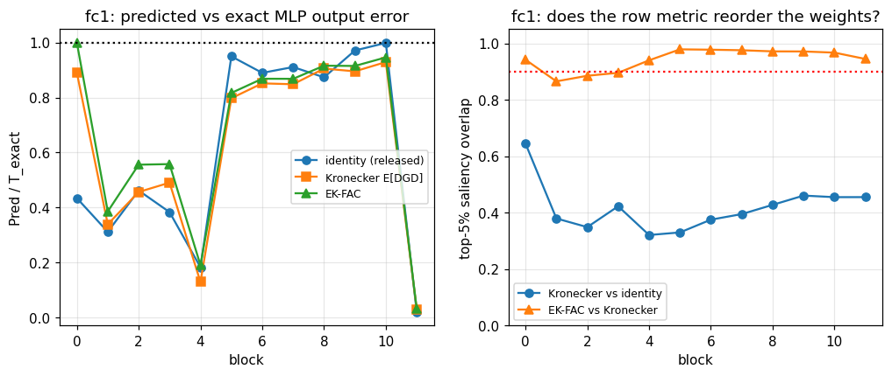

# Phase 4 - fc1 (ReLU-gated) Kronecker gap

```
blk  relu% |   id/T  kron/T   ek/T | id~kron relF massoff | ek~kron relF    null massoff | sal kron-vs-id ek-vs-kron
--------------------------------------------------------------------------------------------------------------------
  0   10.7 |  0.434   0.890  1.000 |        2.801   0.306 |       0.2326  0.0045   0.094 |          0.645      0.942
  1    2.4 |  0.312   0.339  0.386 |        4.372   0.686 |       0.0542  0.0049   0.022 |          0.379      0.865
  2    2.0 |  0.462   0.457  0.556 |        3.359   0.537 |       0.1154  0.0038   0.047 |          0.349      0.885
  3    1.1 |  0.383   0.491  0.558 |        3.009   0.337 |       0.1089  0.0077   0.060 |          0.422      0.895
  4    3.1 |  0.183   0.130  0.191 |        1.885   0.582 |       0.0476  0.0044   0.018 |          0.321      0.940
  5    6.5 |  0.950   0.798  0.817 |        1.478   0.610 |       0.0285  0.0025   0.004 |          0.330      0.979
  6    8.2 |  0.890   0.852  0.868 |        1.350   0.561 |       0.0275  0.0034   0.004 |          0.375      0.977
  7    7.8 |  0.911   0.848  0.868 |        1.231   0.534 |       0.0252  0.0024   0.003 |          0.395      0.975
  8    7.3 |  0.874   0.905  0.916 |        1.209   0.499 |       0.0336  0.0026   0.002 |          0.427      0.971
  9    7.0 |  0.971   0.895  0.915 |        1.205   0.447 |       0.0540  0.0032   0.003 |          0.460      0.971
 10    8.4 |  0.999   0.929  0.946 |        1.329   0.487 |       0.0919  0.0034   0.003 |          0.455      0.967
 11    8.4 |  0.020   0.030  0.032 |        2.558   0.510 |       0.0754  0.0027   0.003 |          0.455      0.945
```

```
identity row metric (released code):  median Pred/T = 0.668, median top-5% saliency overlap vs Kronecker = 0.409
Kronecker E[D G D] ('MLP-aware BoA'):  median Pred/T = 0.823
EK-FAC refit:                          median Pred/T = 0.842, median ek-vs-kron shape gap = 0.0541 (null 0.0034), median top-5% overlap = 0.956
```


